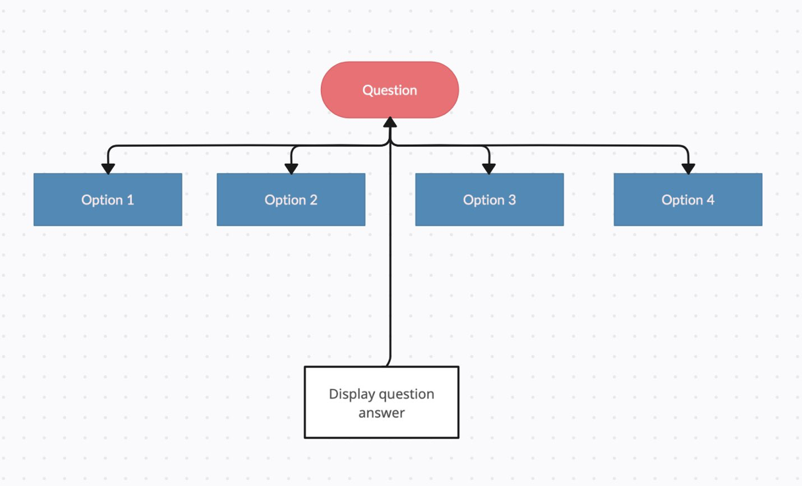
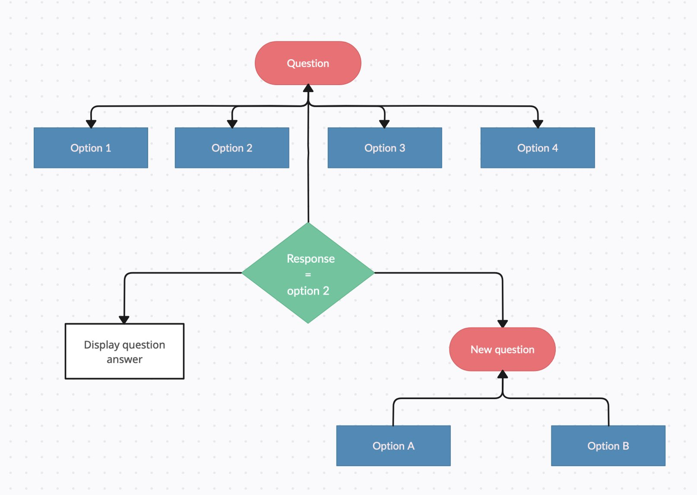
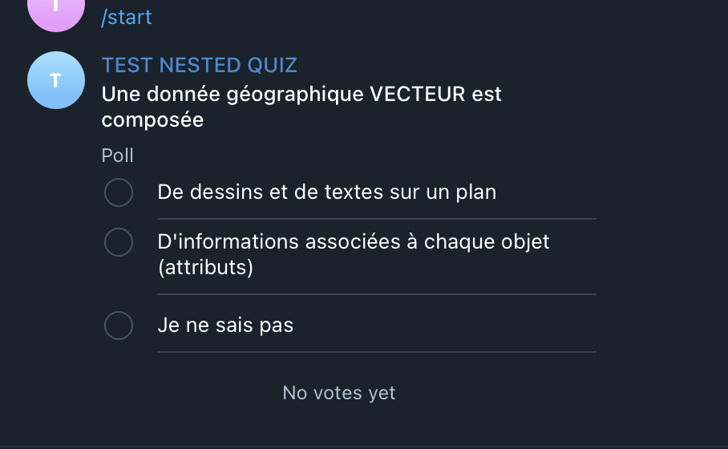
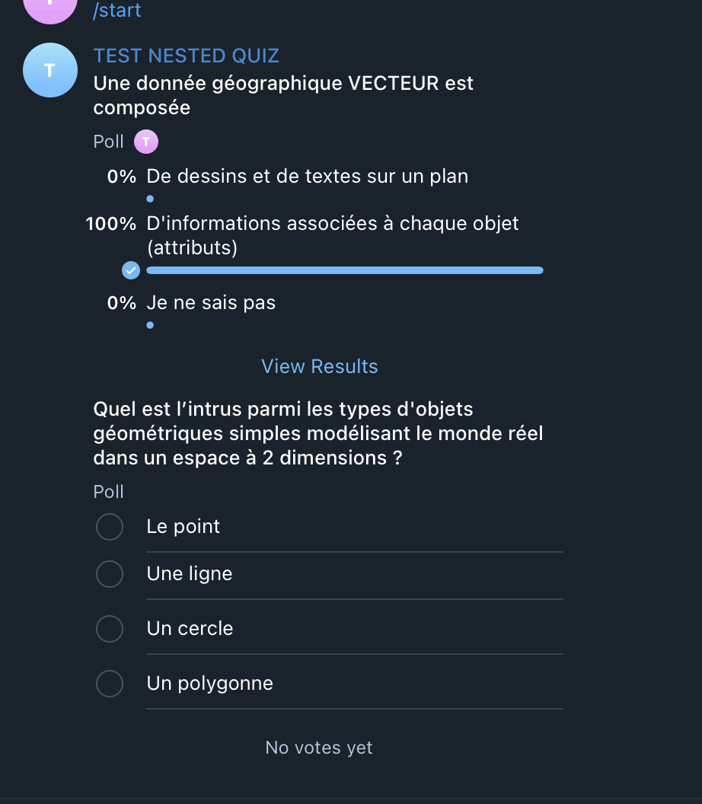

# Telegram nested quiz bot

I tried to create a quiz on Telegram, but after an hour of searching, I couldn't find out how to make a nested quiz. 🤔 Today, there is a bot called "QuizBot" that allows you to easily create quizzes, but it doesn't support nested quizzes. 

The aim of this bot is to feature a nested quiz : depending on the answer to a question, propose another question or not.

## Development    
### setup the application 
- Clone the repository 
- Create an VENV `$ python -m venv venv d`
- Enter in the venv `$ source venv/bin/activate `
- Upgrade pip `$ pip install -U pip `
- Install dependencies `$ pip install -r requirements.txt  `
- Create an `.env` with your **TELEGRAM_TOKEN** token
- Create the `data`directory and add your `quiz_config.json` file 

### construct your  quiz_config.json

Construct it like the schema in `scr/__init__.py` `quiz_config_schema`. An example in data folder 

### Example with the previous quiz_config.json file example
Step 1 : 

Step 2 : 

## Deploy the BOT
### Setup the application
When everything in your server : 
- Create an VENV `$ python -m venv venv d`
- Enter in the venv `$ source venv/bin/activate `
- Upgrade pip `$ pip install -U pip `
- Install dependencies `$ pip install -r requirements.txt  `
- Create an `.env` with your **TELEGRAM_TOKEN** token
- Create the `data`directory and add your `quiz_config.json` file 

### Lunch the application with an UNIX service
- copy file `telegram-nested-quiz-bot.service`  to `/etc/systemd/system/` in your server
- Update the file with your own credentials : `user` and `/path/to/folder`
- ` $ systemctl start telegram-nested-quiz-bot  ` 
- ` $ systemctl enable telegram-nested-quiz-bot  ` 

